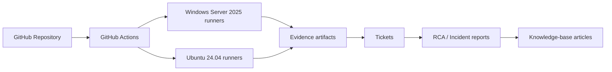

# IT Infrastructure & L2 Technical Support Lab

Scenario-driven Windows/Linux technical-support lab built to demonstrate practical Level 1 / Level 2 investigation, recovery, escalation judgement, root-cause analysis and technical documentation.

## Status

**15 support incidents + Windows/Linux platform baseline completed.** All incidents listed as **Lab validated** were executed in GitHub-hosted environments and required explicit technical verification before being marked resolved.

> This is a hands-on portfolio lab, not production employment experience. Cloud and virtualization claims are scoped to exactly what was executed.

## Role-targeted mini-packs

- `projects/greenco-it-support-mini-pack/` — digital-workplace support pack covering Microsoft 365 support workflows, assets, SLA tracking, access reviews, security awareness and ITSM/ITIL-aware documentation.
- `projects/helpdesk-ticketing-mini-lab/` — 10-ticket first-line helpdesk simulation covering password/account issues, access, software, hardware, connectivity, phishing, L2 escalation, SLA, user communication and closure notes. Zendesk/Freshdesk-style workflow familiarity only; production use is not claimed.

## Architecture



## Evidence standard

- **Executed** — commands/workflows actually ran in the hosted lab.
- **Lab validated** — the fault was reproduced, investigated, corrected/contained, and independently checked.
- **Configuration lab validated** — tooling/configuration was executed and validated without claiming a live cloud deployment.
- **Designed only** — documented but not executed.

Runtime artifacts are retained by GitHub Actions for a limited period; permanent ticket/RCA/KB records and workflow definitions remain in this repository.

## Scenario register

| ID | Scenario | Platform | Main L2 evidence | Status |
|---|---|---|---|---|
| BASELINE | Windows/Linux support baseline | Windows + Linux | OS, IP, DNS, storage, services | Executed |
| INC-001 | Backup destination not writable | Linux | permissions, backup, SHA-256, restore | Lab validated |
| INC-002 | App works by IP but fails by hostname | Windows | TCP/IP, name resolution, PowerShell | Lab validated |
| INC-003 | `systemd` `203/EXEC` service failure | Linux | systemctl, journalctl, executable permissions | Lab validated |
| INC-004 | Filesystem exhaustion breaks app | Linux | df, df -i, du, logs, recovery | Lab validated |
| INC-005 | Scheduled backup fails while manual run works | Linux | systemd timer, environment context, restore | Lab validated |
| INC-006 | NTFS Access Denied despite correct group | Windows | local groups, Get-Acl, icacls, least privilege | Lab validated |
| INC-007 | SSH key rejected despite correct key | Linux | ssh -vvv, sshd logs/config, ports, permissions | Lab validated |
| INC-008 | Windows service stops on startup | Windows | Services, Event Log, Get-WinEvent, TCP | Lab validated |
| INC-009 | Client in wrong subnet cannot reach healthy app | Linux | network namespace, IP, routes, ping, HTTP | Lab validated |
| INC-010 | Package left unconfigured by bad dependency | Linux | dpkg, apt, package metadata/dependencies | Lab validated |
| INC-011 | Windows scheduled backup missing argument | Windows | Task Scheduler, exit code, ZIP, SHA-256, restore | Lab validated |
| INC-012 | Suspicious process + unauthorized listener | Linux | process/socket/file triage, hashing, containment, escalation | Lab validated |
| INC-013 | Virtual disk rollback after bad change | QEMU/qcow2 | snapshots, qemu-img/qemu-io, consistency check | Lab validated |
| INC-014 | Azure NSG configuration misses HTTPS | Azure CLI/Bicep | IaC build, NSG rule/priority analysis | Configuration lab validated |
| INC-015 | Multi-layer service + hostname + backup outage | Linux | systemd, permissions, hostname, backup/restore, RCA | Lab validated |

## Skills demonstrated

### Linux / infrastructure support
Bash, users/service accounts, file permissions, `systemd`, `journalctl`, processes, sockets, SSH, `ip`, routes, network namespaces, `df`/`du`, package management, scheduled jobs, backup/recovery and log analysis.

### Windows support
PowerShell, Windows Services, Application Event Log, `Get-WinEvent`, TCP diagnostics, local groups, NTFS ACLs, `Get-Acl`, `icacls`, Task Scheduler and backup/restore verification.

### Backup and recovery
Failed-backup diagnosis, destination permissions, scheduled-job execution context, archive integrity with SHA-256, separate restore testing and recovery verification.

### Virtualization
Executed QEMU qcow2 virtual-disk snapshot creation, state change, rollback and consistency validation. **This is not described as production VMware/Hyper-V administration.**

### Cloud fundamentals
Executed Azure CLI/Bicep NSG configuration analysis, identified a missing inbound HTTPS rule, corrected priority/order and recompiled the template. **No live Azure tenant/resource deployment is claimed.**

### Security and escalation
Least-privilege remediation, SSH security controls, NTFS deny/allow precedence, suspicious-process triage, evidence preservation, hashing, containment and an explicit Security/IR escalation decision.

### L2 operating method
Every scenario follows: **impact/scope -> evidence -> hypothesis -> minimum change -> independent verification -> residual risk -> escalation decision -> RCA/KB**.

## Selected validated executions

- INC-007 SSH: https://github.com/trust-mudau/it-infrastructure-l2-support-lab/actions/runs/34875106353
- INC-008 Windows service/Event Log: https://github.com/trust-mudau/it-infrastructure-l2-support-lab/actions/runs/34875803731
- INC-009 IP/subnet: https://github.com/trust-mudau/it-infrastructure-l2-support-lab/actions/runs/34875835212
- INC-010 package dependency: https://github.com/trust-mudau/it-infrastructure-l2-support-lab/actions/runs/34875864469
- INC-011 Windows scheduled backup: https://github.com/trust-mudau/it-infrastructure-l2-support-lab/actions/runs/34875898930
- INC-012 security triage: https://github.com/trust-mudau/it-infrastructure-l2-support-lab/actions/runs/34875933477
- INC-013 snapshot recovery: https://github.com/trust-mudau/it-infrastructure-l2-support-lab/actions/runs/34875963864
- INC-014 Azure/Bicep NSG: https://github.com/trust-mudau/it-infrastructure-l2-support-lab/actions/runs/34876110072
- INC-015 multi-layer capstone: https://github.com/trust-mudau/it-infrastructure-l2-support-lab/actions/runs/34876267799

## Repository layout

```text
.github/workflows/   executable lab scenarios
tickets/             service-desk style incident records
incidents/           root-cause / incident reports
kb/                  reusable knowledge-base articles
evidence/            evidence policy and sanitized evidence notes
docs/                lab design and troubleshooting methodology
scripts/             reusable Bash/PowerShell tooling
projects/             compact role-targeted support scenario packs
reports/              final technical/job-fit reporting
```

## Truthful portfolio/CV positioning

> Built and validated a 15-incident Windows/Linux L2 technical-support lab using GitHub-hosted environments, covering service and Event Log analysis, TCP/IP/name resolution, SSH, permissions, storage, package dependencies, scheduled tasks, backup/restore, security triage, virtual-disk snapshot recovery and Azure/Bicep network-security configuration; documented each scenario through tickets, root-cause analysis, verification and escalation decisions.

Do **not** describe this repository as production infrastructure, VMware/Hyper-V, live Azure administration, or production Zendesk/Freshdesk experience.