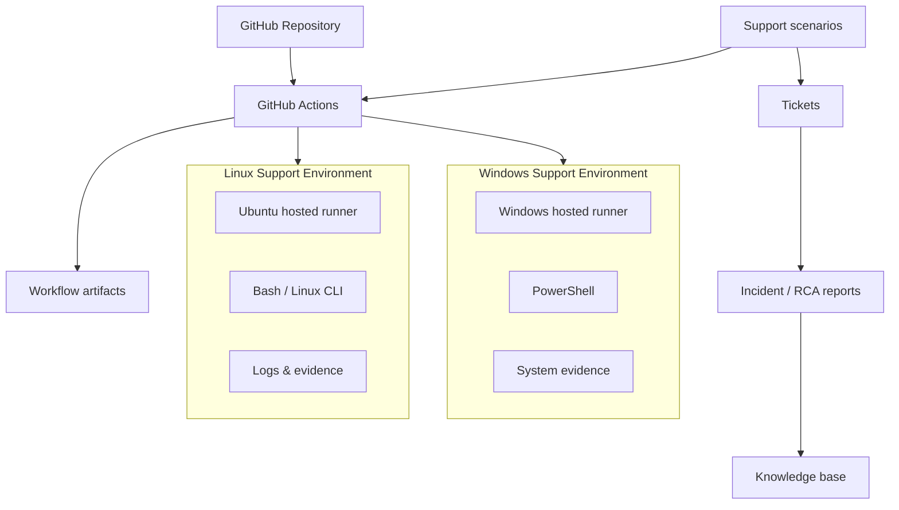

# IT Infrastructure & L2 Technical Support Lab

Scenario-driven technical support lab focused on realistic Level 1 / Level 2 infrastructure incidents using GitHub-hosted Windows and Linux environments.

## Project purpose

This repository is designed to build practical troubleshooting evidence for remote technical-support, MSP, infrastructure-support and junior systems roles. It emphasizes diagnosis, verification, recovery, escalation judgement, root-cause analysis and technical documentation rather than memorised theory.

## Current status

**Phase:** Active scenario execution  
**Platform baseline:** Windows and Linux hosted-runner capture — executed successfully  
**Scenario 01:** Linux backup permission failure — **lab validated and resolved**  
**Scenario 02:** Windows hostname/name-resolution failure — **lab validated and resolved**  
**Scenario 03:** Linux `systemd` service execution failure — **lab validated and resolved**  
**Scenario 04:** Linux disk/storage exhaustion — **lab validated and resolved**  
**Scenario 05:** Scheduled backup environment failure — **lab validated and resolved**  
**Scenario 06:** Windows NTFS access-denied / ACL conflict — **lab validated and resolved**

## Evidence standard

Every claim in this repository is labelled honestly:

- **Executed** — commands or workflows actually ran in a GitHub-hosted lab environment.
- **Scenario validated** — a realistic simulated incident was investigated using supplied or generated technical evidence.
- **Designed only** — documentation exists, but the technical action has not been executed.
- **Not implemented** — intentionally excluded because of environment, licensing or hardware limitations.

This project does **not** represent production employment experience. It is a hands-on support lab.

## Lab architecture



## Planned skill coverage

- Linux CLI administration and troubleshooting
- Windows / PowerShell troubleshooting
- TCP/IP, DNS and connectivity diagnostics
- Processes and services
- Logs and event analysis
- Users, groups and permissions
- Disk and storage troubleshooting
- Backup, failed-backup investigation and recovery
- Scheduled-job troubleshooting
- Virtualization concepts and recovery decisions
- Cloud fundamentals
- Security-related troubleshooting
- L1/L2 ticket handling
- Escalation decisions
- Root-cause analysis
- Knowledge-base writing

## Repository structure

```text
.github/workflows/   Automated lab scenarios
docs/                Architecture, methodology and lab documentation
scripts/             Bash and PowerShell tools used in scenarios
tickets/             Realistic support tickets
incidents/           Root-cause / incident reports
kb/                  Knowledge-base articles
evidence/            Evidence policy and sanitized artifacts
reports/             Final technical report and job-fit audit
templates/           Reusable support-document templates
```

## Scenario register

| ID | Scenario | Platform | Primary skills | Status |
|---|---|---|---|---|
| BASELINE | Windows/Linux support baseline | Windows + Linux | OS, IP, DNS, storage, services | Executed |
| INC-001 | Backup job fails because destination is not writable | Linux | Bash, permissions, logs, backup/recovery, RCA | Lab validated |
| INC-002 | Application works by IP but fails by hostname | Windows | PowerShell, TCP/IP, name resolution, service validation | Lab validated |
| INC-003 | systemd service fails with `203/EXEC` | Linux | systemd, journalctl, processes, permissions, sockets, service recovery | Lab validated |
| INC-004 | Application fails because filesystem reaches 100% utilization | Linux | df, df -i, du, storage analysis, logs, systemd, recovery | Lab validated |
| INC-005 | Scheduled backup fails while manual run succeeds | Linux | systemd timers, environment context, backup, integrity, restore testing | Lab validated |
| INC-006 | Access Denied despite correct support-group membership | Windows | local groups, NTFS ACLs, Get-Acl, icacls, least privilege | Lab validated |

Additional scenarios are added only when they are ready to be executed and documented.

## Troubleshooting model

Each scenario follows the same L2 workflow:

1. Confirm impact and scope.
2. Gather evidence before changing anything.
3. Form and rank hypotheses.
4. Test the safest/highest-value hypothesis first.
5. Apply the minimum corrective change.
6. Verify service restoration independently.
7. Check for residual risk or recurrence.
8. Document cause, resolution and escalation decision.
9. Convert reusable findings into a knowledge-base article where appropriate.

## Validated evidence to date

### INC-001 — Linux backup permission failure

Executed on Ubuntu 24.04.5 LTS using GitHub Actions.

- reproduced non-zero backup failure with exit code `13`
- inspected identity, directory permissions and filesystem capacity before remediation
- ruled out storage exhaustion
- confirmed destination mode `0555` blocked writes
- applied minimum permission correction to `0750`
- reran backup successfully
- validated SHA-256 integrity
- restored the archive and compared restored data with the source
- documented the incident, root cause and escalation decision

See:

- `tickets/INC-001-linux-backup-failure.md`
- `incidents/INC-001-RCA-linux-backup-permission-failure.md`
- `kb/KB-001-linux-backup-destination-not-writable.md`

### INC-002 — Windows name-resolution failure

Executed on Windows Server 2025 Datacenter using PowerShell 7.6.5.

- verified the application returned HTTP `200` by direct IP
- confirmed the service was listening on `127.0.0.1:8080`
- reproduced hostname access failure
- inspected Windows IP/DNS configuration and the local hosts file
- confirmed `support-app.lab` incorrectly resolved to `127.0.0.2`
- compared direct-IP and hostname TCP results with `Test-NetConnection`
- corrected the mapping to `127.0.0.1`
- flushed the Windows DNS resolver cache
- independently verified correct resolution, TCP connectivity and HTTP content

See:

- `tickets/INC-002-windows-name-resolution-failure.md`
- `incidents/INC-002-RCA-windows-name-resolution-failure.md`
- `kb/KB-002-windows-hostname-connectivity-failure.md`

### INC-003 — Linux systemd service execution failure

Executed on Ubuntu 24.04.5 LTS with a real temporary `systemd` unit.

- reproduced an unavailable application and failed service state
- confirmed `systemctl is-active` failure and curl connection failure
- used `systemctl status` to identify `status=203/EXEC`
- used `journalctl -u` to confirm the main process execution failure
- inspected the service unit with `systemctl cat`
- used `ls`, `stat` and `namei` to validate the `ExecStart` path and permissions
- confirmed `/opt/l2lab/service.sh` was mode `0644` and therefore not executable
- applied the minimum correction to `0755`
- restarted the unit and verified it was `active`
- confirmed `python3` was listening on `127.0.0.1:8090`
- independently verified the expected HTTP application content

See:

- `tickets/INC-003-linux-systemd-service-failure.md`
- `incidents/INC-003-RCA-linux-systemd-service-failure.md`
- `kb/KB-003-systemd-203-exec-service-failure.md`

### INC-004 — Linux disk/storage exhaustion

Executed on Ubuntu 24.04.5 LTS using an isolated 20 MiB temporary filesystem.

- reproduced a real `No space left on device` failure during application startup
- confirmed the filesystem reached `100%` block utilization
- checked `df -i` and ruled out inode exhaustion at only `1%` inode use
- used `du` and `find` to identify an 18 MiB stale application log as the dominant storage consumer
- connected the storage condition to the failed `systemd` service using `systemctl` and `journalctl`
- applied an approved minimum cleanup to the confirmed stale log
- reduced filesystem utilization from `100%` to `25%`
- verified the 4 MiB runtime cache could be created successfully
- confirmed the service was active and `python3` listened on `127.0.0.1:8091`
- independently verified expected HTTP application content

See:

- `tickets/INC-004-linux-disk-exhaustion.md`
- `incidents/INC-004-RCA-linux-disk-exhaustion.md`
- `kb/KB-004-linux-disk-full-service-failure.md`

### INC-005 — Scheduled backup environment failure

Executed on Ubuntu 24.04.5 LTS using a real temporary `systemd` timer and oneshot service.

- proved the same backup script succeeded manually when `BACKUP_DEST` was explicitly supplied
- triggered the scheduled path with `l2backup.timer`
- reproduced a failed scheduled service and confirmed no archive was created
- used `systemctl status`, `systemctl list-timers`, `journalctl`, `systemctl cat` and `systemctl show` to compare execution contexts
- confirmed the service environment did not contain the required `BACKUP_DEST` variable
- ruled out source/destination permission problems
- corrected the service with a root-managed `EnvironmentFile`
- reran the service successfully without changing backup-script logic
- created and validated the backup archive with SHA-256
- restored the archive into a separate directory and verified restored data matched the source

See:

- `tickets/INC-005-scheduled-backup-environment-failure.md`
- `incidents/INC-005-RCA-scheduled-backup-environment-failure.md`
- `kb/KB-005-systemd-scheduled-job-manual-run-succeeds.md`

### INC-006 — Windows NTFS Access Denied despite correct group membership

Executed on Windows Server 2025 Datacenter using PowerShell and a real local Windows group / NTFS ACL.

- created and verified the `L2-App-Support` local group
- confirmed the current support account was a member of the group
- granted the group NTFS `Modify` permission on a protected support directory
- reproduced a real `Access to the path ... is denied` failure
- used `whoami`, `Get-LocalGroupMember`, `Get-Acl` and `icacls` to investigate identity and permissions
- confirmed a direct explicit `ReadData` deny ACE existed on the user while the group retained its allow permission
- identified ACL precedence as the cause rather than missing group membership
- removed only the conflicting direct deny ACE
- preserved the group-based `Modify` grant rather than using a broad `Everyone` or Full Control workaround
- independently verified protected-file read and write access after remediation

See:

- `tickets/INC-006-windows-ntfs-access-denied.md`
- `incidents/INC-006-RCA-windows-ntfs-access-denied.md`
- `kb/KB-006-windows-ntfs-access-denied-group-membership.md`

## Truthful CV positioning

Current safe description:

> Built a scenario-driven Windows/Linux L2 technical-support lab using GitHub-hosted environments and structured incident documentation; executed backup/recovery, scheduled-job, Windows name-resolution and NTFS-permissions incidents plus Linux systemd and disk-capacity failures using Bash, PowerShell, systemctl, journalctl, timers, df/du, TCP diagnostics, Get-Acl/icacls, checksum/restore validation, least-privilege remediation, root-cause analysis and escalation judgement.

Do not describe this repository as production infrastructure experience.
