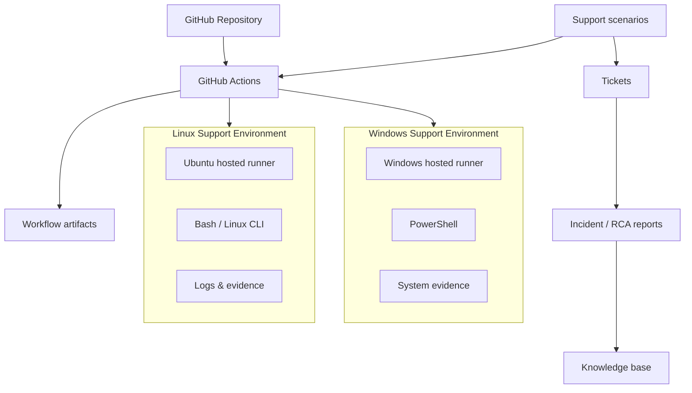

# IT Infrastructure & L2 Technical Support Lab

Scenario-driven technical support lab focused on realistic Level 1 / Level 2 infrastructure incidents using GitHub-hosted Windows and Linux environments.

## Project purpose

This repository is designed to build practical troubleshooting evidence for remote technical-support, MSP, infrastructure-support and junior systems roles. It emphasizes diagnosis, verification, recovery, escalation judgement, root-cause analysis and technical documentation rather than memorised theory.

## Current status

**Phase:** Active scenario execution  
**Platform baseline:** Windows and Linux hosted-runner capture — executed successfully  
**Scenario 01:** Linux backup permission failure — **lab validated and resolved**  
**Scenario 02:** Windows hostname/name-resolution failure — **lab validated and resolved**

## Evidence standard

Every claim in this repository is labelled honestly:

- **Executed** — commands or workflows actually ran in a GitHub-hosted lab environment.
- **Scenario validated** — a realistic simulated incident was investigated using supplied or generated technical evidence.
- **Designed only** — documentation exists, but the technical action has not been executed.
- **Not implemented** — intentionally excluded because of environment, licensing or hardware limitations.

This project does **not** represent production employment experience. It is a hands-on support lab.

## Lab architecture



## Planned skill coverage

- Linux CLI administration and troubleshooting
- Windows / PowerShell troubleshooting
- TCP/IP, DNS and connectivity diagnostics
- Processes and services
- Logs and event analysis
- Users, groups and permissions
- Disk and storage troubleshooting
- Backup, failed-backup investigation and recovery
- Scheduled-job troubleshooting
- Virtualization concepts and recovery decisions
- Cloud fundamentals
- Security-related troubleshooting
- L1/L2 ticket handling
- Escalation decisions
- Root-cause analysis
- Knowledge-base writing

## Repository structure

```text
.github/workflows/   Automated lab scenarios
docs/                Architecture, methodology and lab documentation
scripts/             Bash and PowerShell tools used in scenarios
tickets/             Realistic support tickets
incidents/           Root-cause / incident reports
kb/                  Knowledge-base articles
evidence/            Evidence policy and sanitized artifacts
reports/             Final technical report and job-fit audit
templates/           Reusable support-document templates
```

## Scenario register

| ID | Scenario | Platform | Primary skills | Status |
|---|---|---|---|---|
| BASELINE | Windows/Linux support baseline | Windows + Linux | OS, IP, DNS, storage, services | Executed |
| INC-001 | Backup job fails because destination is not writable | Linux | Bash, permissions, logs, backup/recovery, RCA | Lab validated |
| INC-002 | Application works by IP but fails by hostname | Windows | PowerShell, TCP/IP, name resolution, service validation | Lab validated |

Additional scenarios are added only when they are ready to be executed and documented.

## Troubleshooting model

Each scenario follows the same L2 workflow:

1. Confirm impact and scope.
2. Gather evidence before changing anything.
3. Form and rank hypotheses.
4. Test the safest/highest-value hypothesis first.
5. Apply the minimum corrective change.
6. Verify service restoration independently.
7. Check for residual risk or recurrence.
8. Document cause, resolution and escalation decision.
9. Convert reusable findings into a knowledge-base article where appropriate.

## Validated evidence to date

### INC-001 — Linux backup permission failure

Executed on Ubuntu 24.04.5 LTS using GitHub Actions.

- reproduced non-zero backup failure with exit code `13`
- inspected identity, directory permissions and filesystem capacity before remediation
- ruled out storage exhaustion
- confirmed destination mode `0555` blocked writes
- applied minimum permission correction to `0750`
- reran backup successfully
- validated SHA-256 integrity
- restored the archive and compared restored data with the source
- documented the incident, root cause and escalation decision

See:

- `tickets/INC-001-linux-backup-failure.md`
- `incidents/INC-001-RCA-linux-backup-permission-failure.md`
- `kb/KB-001-linux-backup-destination-not-writable.md`

### INC-002 — Windows name-resolution failure

Executed on Windows Server 2025 Datacenter using PowerShell 7.6.5.

- verified the application returned HTTP `200` by direct IP
- confirmed the service was listening on `127.0.0.1:8080`
- reproduced hostname access failure
- inspected Windows IP/DNS configuration and the local hosts file
- confirmed `support-app.lab` incorrectly resolved to `127.0.0.2`
- compared direct-IP and hostname TCP results with `Test-NetConnection`
- corrected the mapping to `127.0.0.1`
- flushed the Windows DNS resolver cache
- independently verified correct resolution, TCP connectivity and HTTP content

See:

- `tickets/INC-002-windows-name-resolution-failure.md`
- `incidents/INC-002-RCA-windows-name-resolution-failure.md`
- `kb/KB-002-windows-hostname-connectivity-failure.md`

## Truthful CV positioning

Current safe description:

> Built a scenario-driven Windows/Linux L2 technical-support lab using GitHub-hosted environments and structured incident documentation; executed backup/recovery and Windows name-resolution incidents using Bash, PowerShell, TCP diagnostics, permissions analysis, integrity testing, root-cause analysis and escalation judgement.

Do not describe this repository as production infrastructure experience.
