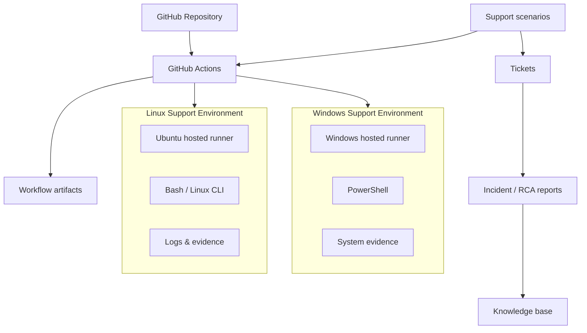

# IT Infrastructure & L2 Technical Support Lab

Scenario-driven technical support lab focused on realistic Level 1 / Level 2 infrastructure incidents using GitHub-hosted Windows and Linux environments.

## Project purpose

This repository is designed to build practical troubleshooting evidence for remote technical-support, MSP, infrastructure-support and junior systems roles. It emphasizes diagnosis, verification, recovery, escalation judgement, root-cause analysis and technical documentation rather than memorised theory.

## Current status

**Phase:** Scenario lab initialized  
**Scenario 01:** Linux backup failure — configured for GitHub Actions execution

## Evidence standard

Every claim in this repository is labelled honestly:

- **Executed** — commands or workflows actually ran in a GitHub-hosted lab environment.
- **Scenario validated** — a realistic simulated incident was investigated using supplied or generated technical evidence.
- **Designed only** — documentation exists, but the technical action has not been executed.
- **Not implemented** — intentionally excluded because of environment, licensing or hardware limitations.

This project does **not** represent production employment experience. It is a hands-on support lab.

## Lab architecture



## Planned skill coverage

- Linux CLI administration and troubleshooting
- Windows / PowerShell troubleshooting
- TCP/IP, DNS and connectivity diagnostics
- Processes and services
- Logs and event analysis
- Users, groups and permissions
- Disk and storage troubleshooting
- Backup, failed-backup investigation and recovery
- Scheduled-job troubleshooting
- Virtualization concepts and recovery decisions
- Cloud fundamentals
- Security-related troubleshooting
- L1/L2 ticket handling
- Escalation decisions
- Root-cause analysis
- Knowledge-base writing

## Repository structure

```text
.github/workflows/   Automated lab scenarios
docs/                Architecture, methodology and lab documentation
scripts/             Bash and PowerShell tools used in scenarios
tickets/             Realistic support tickets
incidents/           Root-cause / incident reports
kb/                  Knowledge-base articles
evidence/            Evidence policy and sanitized artifacts
reports/             Final technical report and job-fit audit
templates/           Reusable support-document templates
```

## Scenario register

| ID | Scenario | Platform | Primary skills | Status |
|---|---|---|---|---|
| INC-001 | Backup job fails because destination is not writable | Linux | Bash, permissions, logs, backup/recovery, RCA | Workflow configured |

Additional scenarios are added only when they are ready to be executed and documented.

## Troubleshooting model

Each scenario follows the same L2 workflow:

1. Confirm impact and scope.
2. Gather evidence before changing anything.
3. Form and rank hypotheses.
4. Test the safest/highest-value hypothesis first.
5. Apply the minimum corrective change.
6. Verify service restoration independently.
7. Check for residual risk or recurrence.
8. Document cause, resolution and escalation decision.
9. Convert reusable findings into a knowledge-base article where appropriate.

## Truthful CV positioning

Until additional scenarios are executed, the safe description is:

> Built a scenario-driven Windows/Linux L2 technical-support lab using GitHub-hosted environments, structured tickets and technical documentation to practice infrastructure troubleshooting, backup/recovery, root-cause analysis and escalation workflows.

Do not describe this repository as production infrastructure experience.
